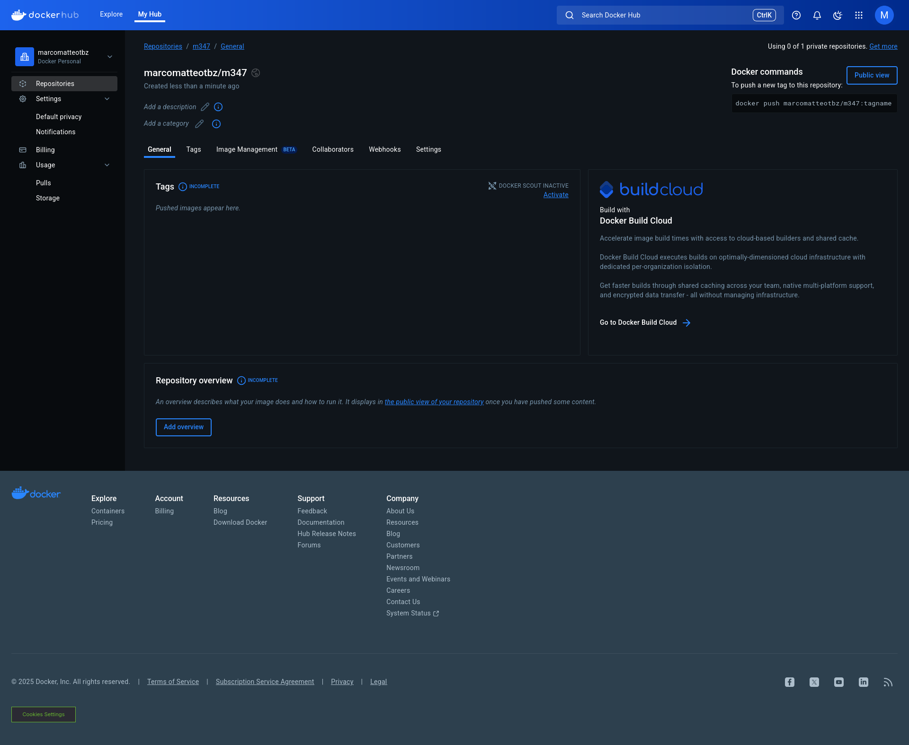

# B)
1. `docker --version`
2.
    `docker search ubuntu`
    `docker search nginx`
3.
    `docker run -d -p 80:80 docker/getting-started`
    `-d`: Detach -> Container runt im Hintergrund
    `-p`: Öffnet den Port 80 auf dem Hostsystem und verbindet ihn mit dem Port 80 im Container
4.
    
5.
    1. Es wurde automatisch heruntergeladen und konnte starten. Es wurde aber direkt wieder gestoppt.
    2. `-i`: Interactive -> Macht den Container interaktiv. 
       `-t` TTY -> Öffnet ein Terminal für den Container
       Man kommt in die Command Line des Ubuntu Containers
6.
    1.
       
7.
    
8. `docker stop e2`
9. `docker rm ad 25 e2` 
10. `docker image rm ubuntu nginx` oder `docker rmi ubuntu nginx`
# C)

# D)
`docker tag nginx:latest mariotbz/m347:nginx`
Erstellt Target-Image, das von einem Source-Image kopiert wird
`docker push mariotbz/m347:nginx`
Pusht ein Lokales image auf das Repo, welches der Name referenziert

