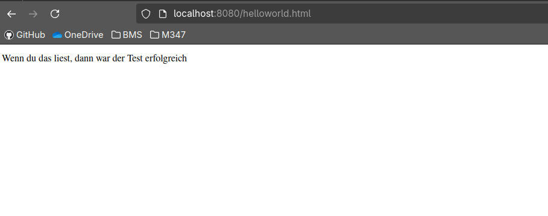
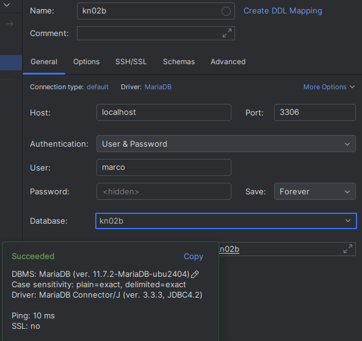
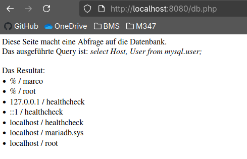
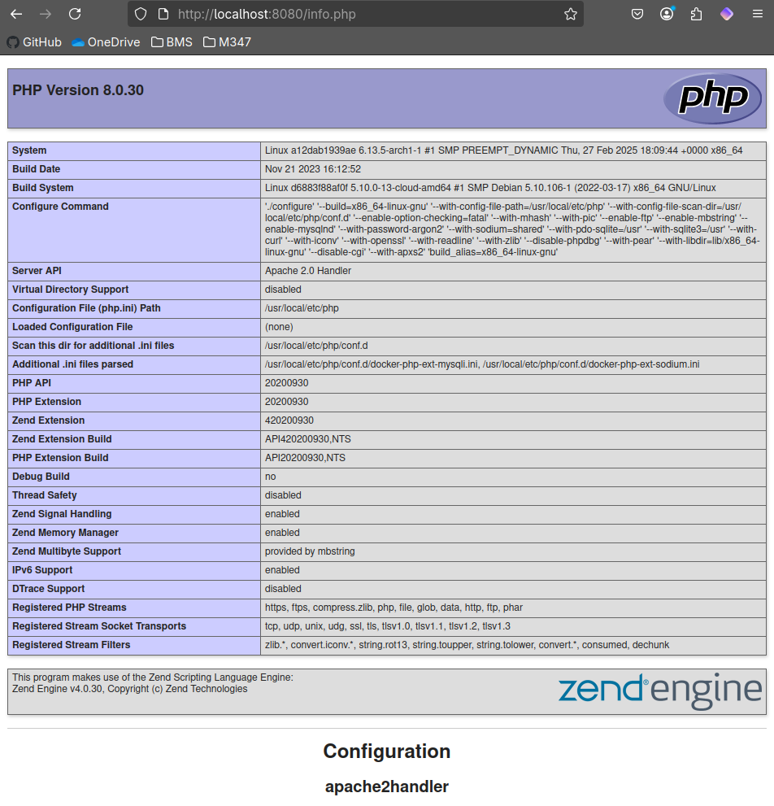

# Dockerfiles

```Dockerfile
FROM nginx  # Mit FROM kann man das Origin Image Definieren
COPY static-html-directory /var/www/html # Mit COPY kann man ein Verzeichnis oder eine Datei auf den gegebenen Pfad im Docker Container kopieren.
EXPOSE 	80	# Mit EXPOSE 80 wird gesagt das der port 80 offen ist und gemappt werden sollte.
```





## Commands

### build
```shell
docker build -t kn02b-db .

docker build -t kn02b-web .
```

### run
```shell
docker run -d --name kn02b-db -p 3306:3306 kn02b-db

docker run -d --name kn02b-web -p 8080:80 --link kn02b-db kn02b-web
 ```

## Screenshots

