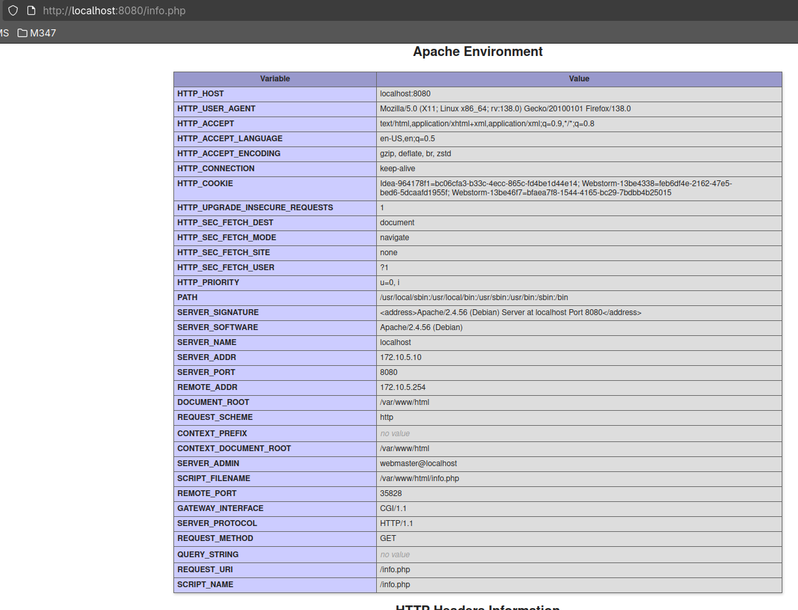
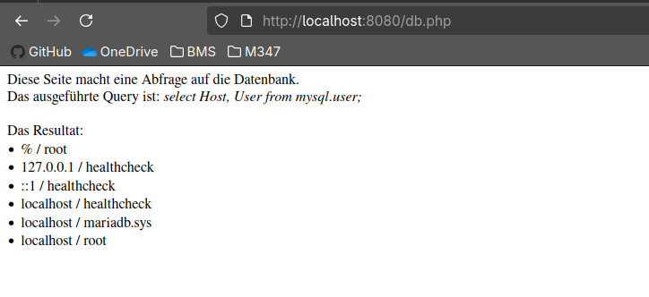
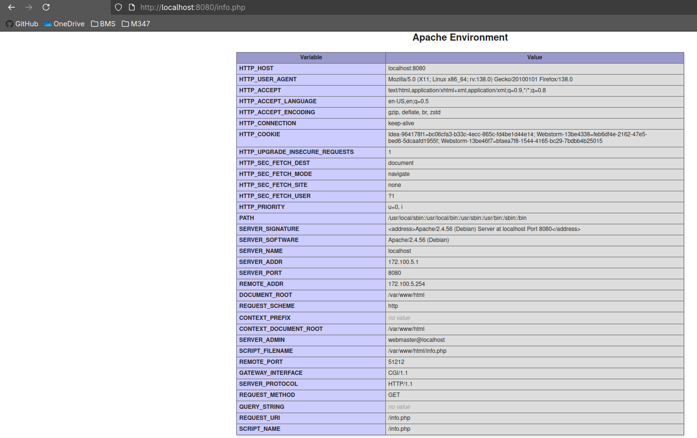
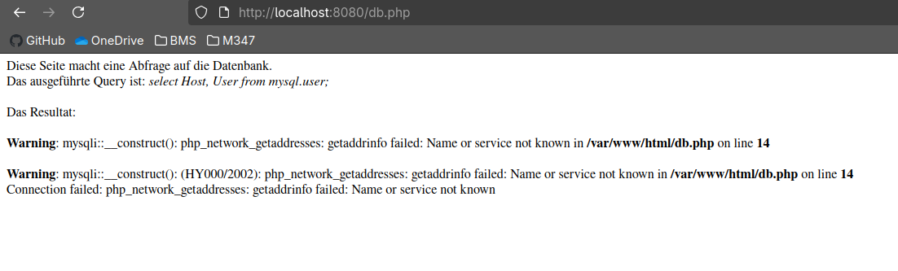
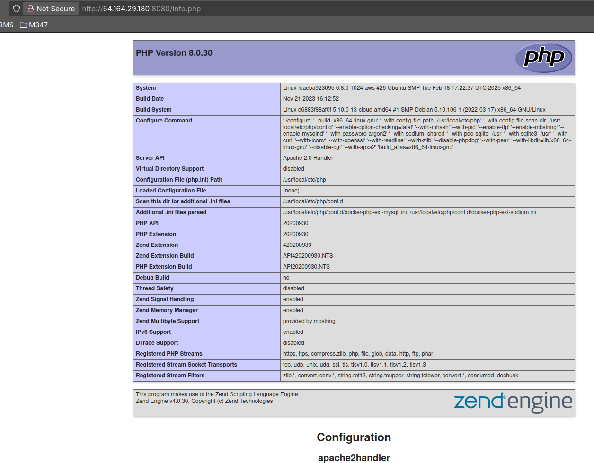
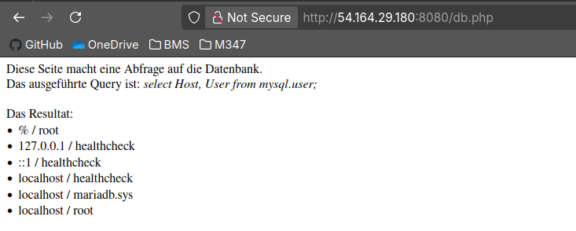

# Docker Compose

# Docker Compose Lokal
## A.
### info.php


### db.php


### Befehle
```shell
docker compose up -d
```
```shell
docker compose down
```
Wenn man docker compose nutzt, braucht man im grunde nur zwei commands.  
Mit `docker compose up` startet man das docker compose file im aktuellen Verzeichnis. 
Die -d flag steht für detach also im Hintergrund laufen lassen.

Mit `docker compose down` kann man alles, das mit dem docker compose file
aus dem aktuellen Verzeichnis gestartet wurde auch wieder löschen/beenden.

## B.
### info.php

### db.php


### warum funktioniert es nicht?
Als wir das Docker-Image für KN02 erstellt haben, hatte `db.php` noch einen anderen Namen in der `$servername`-Variable.
Das heißt, dass im Image noch die alte Version von `db.php` kopiert ist und wir diese nicht für KN04a nutzen können.
Wir könnten allerdings einfach das Image mit dem neuen db.php builden, und schon hätten wir die neue Version des Files im Image verbaut, welche wir in KN04 nutzen können.

# Docker Compose in der Cloud


