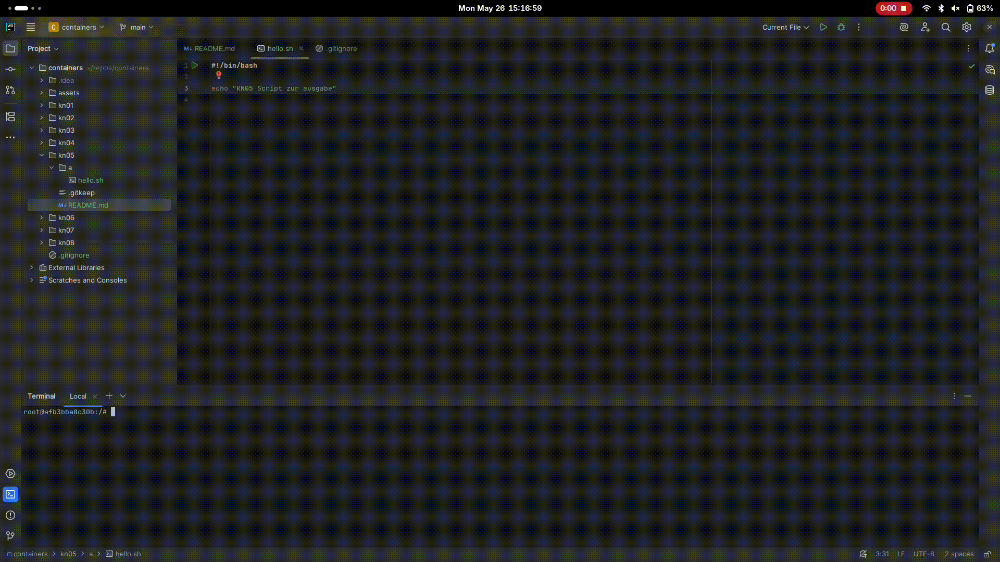
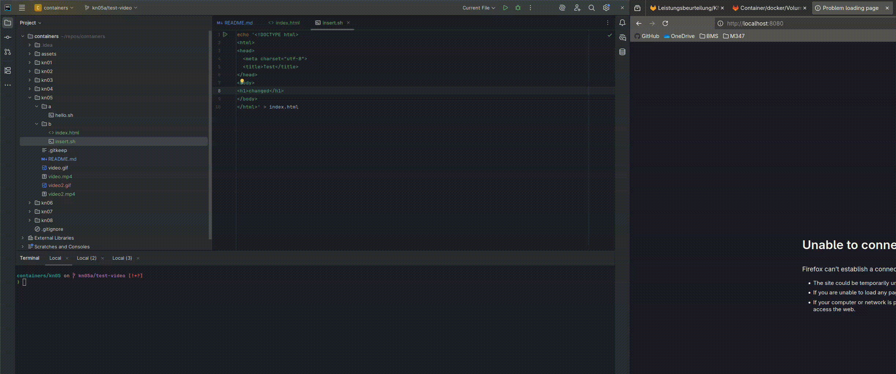
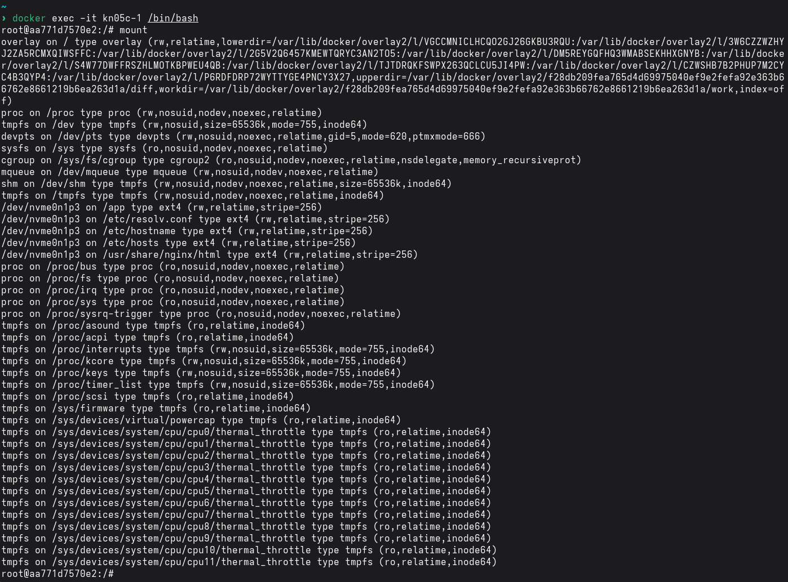
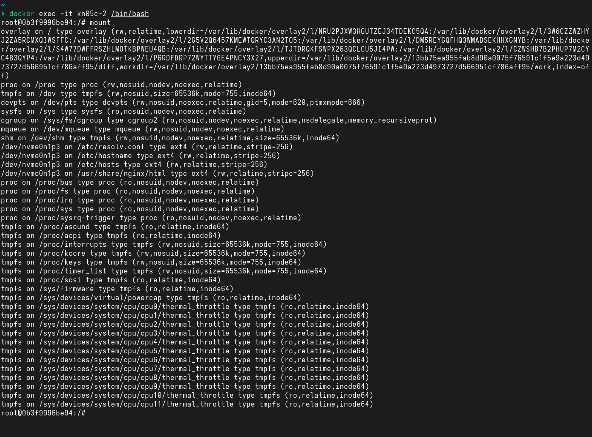

# Speicher in Docker

## A.

```shell
mkdir docker-dir
```

```shell
docker run -it --name kn05a -v ./docker-dir:/app ubuntu /bin/bash
```


[download mp4 here (better resolution)](video.mp4)

# B. 

Create Volume
```shell
docker volume create kn05b
```

```shell
docker run --name kn05b-1 -v kn05b:/usr/share/nginx/html -p 8080:80 -d nginx
```

```shell
 docker run -it --name kn05b-2 -v kn05b:/app ubuntu /bin/bash
```

  
[download mp4 here (better resolution)](video2.mp4)

# C.

## Mount befehl in den beiden Container
### erster Container

### zweiter Container

