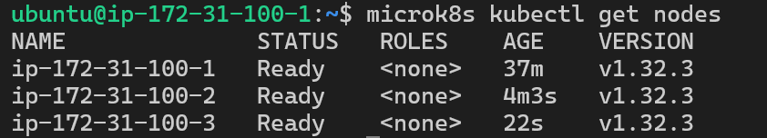
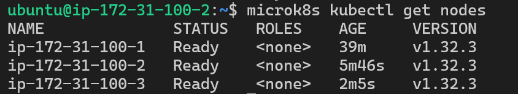
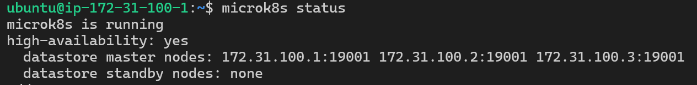
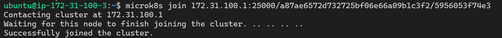
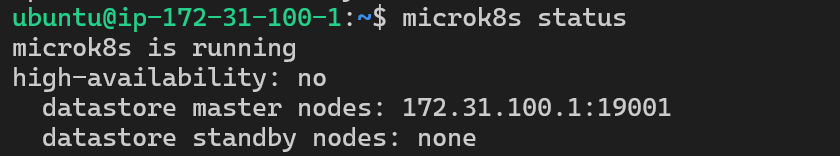
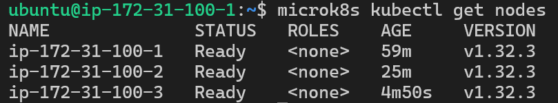
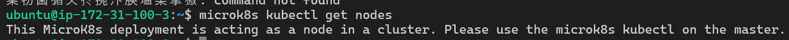

# A)
Subnet: 172.31.100.0/20
Private IP Master: 172.31.100.1
Public IP Master: 54.88.69.67
Private IP Node1: 172.31.100.2
Public IP Node1: 13.216.61.123
Private IP Node2: 172.31.100.3
Public IP Node2: 52.1.176.51


# B)
## Workers von anderem Node aus

## microk8s status

```bash
# microk8s läuft gerade
microk8s is running
# Ab 3 Nodes ist es highly availible und vor single failures geschützt
high-availability: yes
  # Alle unsere Nodes sind als master hinzugefügt werden
  datastore master nodes: 172.31.100.1:19001 172.31.100.2:19001 172.31.100.3:19001
  # Aktuell befinden sich keine Nodes im Standby modus
  datastore standby nodes: none
```
## Node entfernen
### Schritt 1

### Schritt 2

## Node als Worker hinzufügen

Nicht mehr highly availiable, weil der Worker kein Control Panel hat.
## Get nodes
### Worker

### Node2 (Worker)

Weil Worker Nodes kein Control Panel haben, können sie diese Commands nicht ausführen.
# Unterschied microk8s und microk8s kubectl
## microk8s
Damit kann man seinen Cluster administrieren
## microk8s kubectl
Kubectl gibt es auch ausserhalb von microk8s. Damit kann man seine Cluster verwalten.
