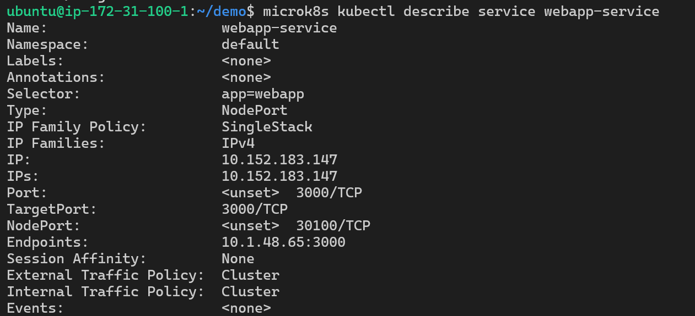
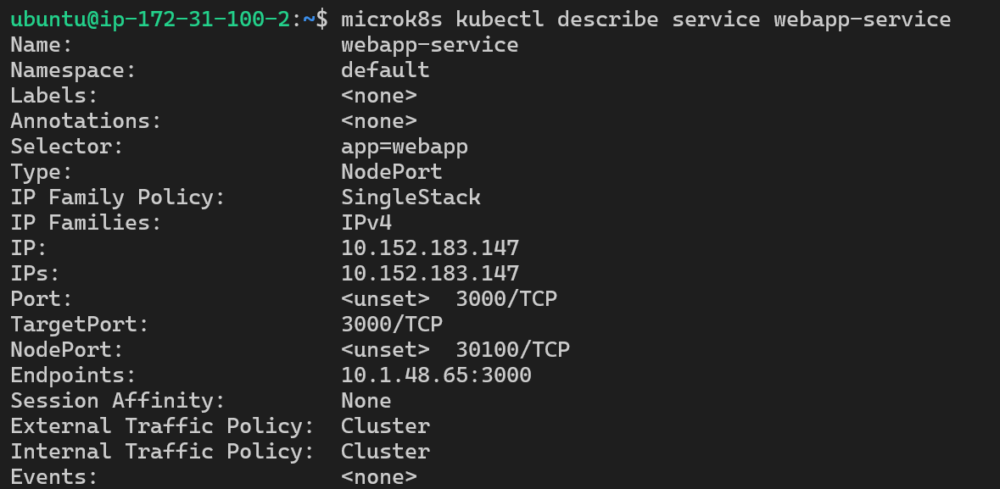
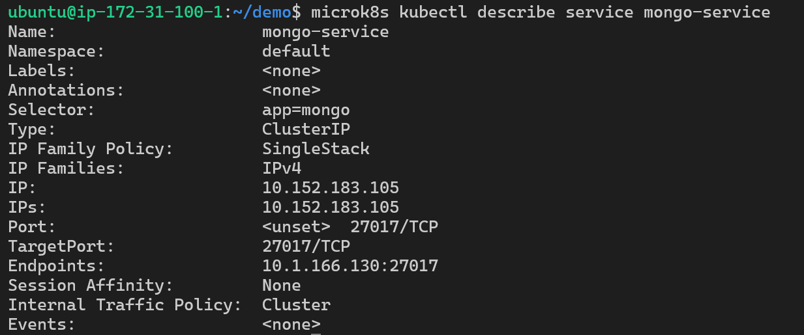
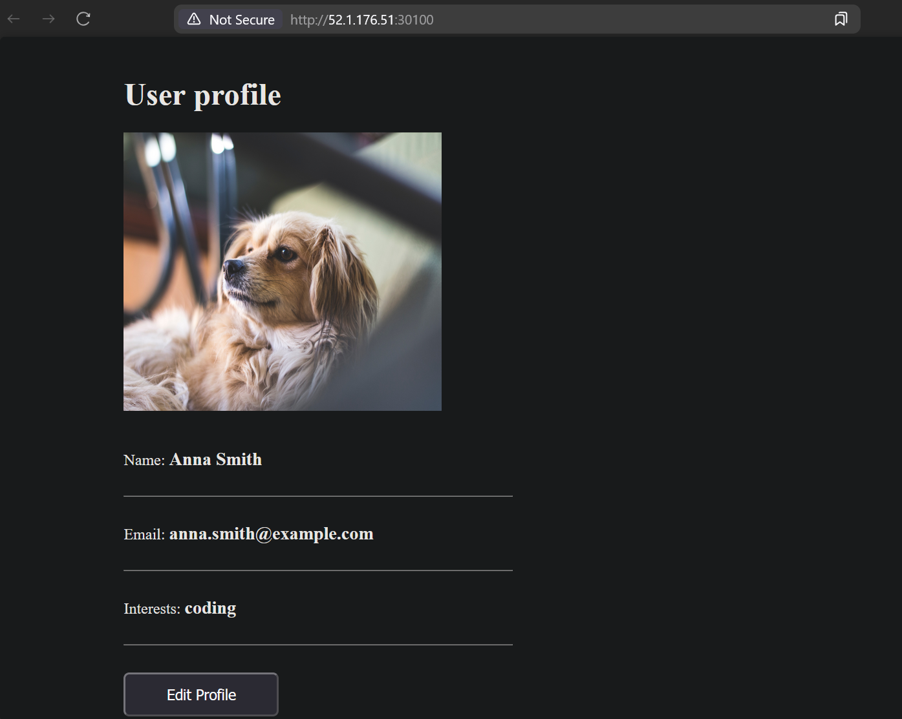
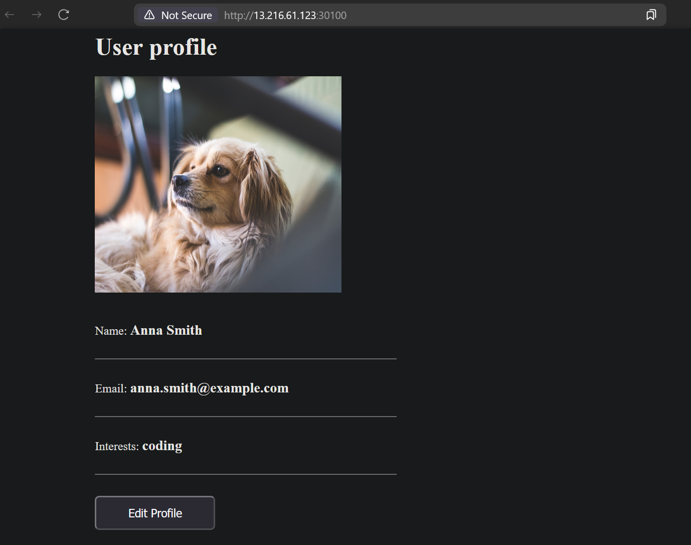
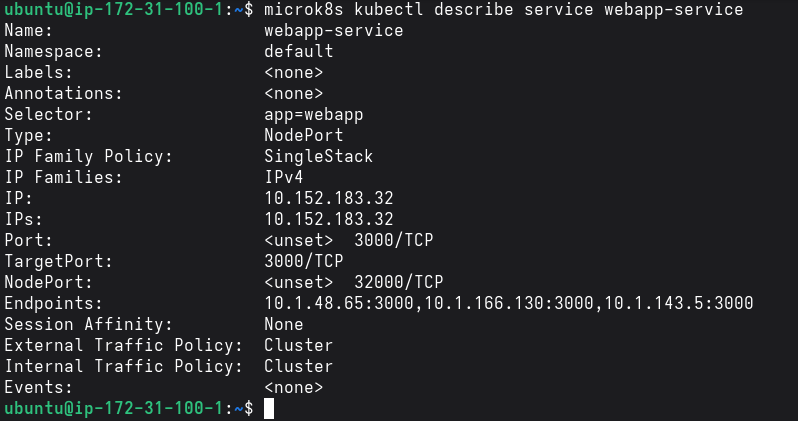

# KN07
## A)
### Unterschied Pods und Replicas
    - Pods ist eine Abstraktion über dem Container
    - Replicas sind wie oft man die Pods für eine App will
### Unterschied Service und Deployment
    - Service ist der Teil welcher eine statische (interne) ip hat und zugriff auf die Pods erschafft
    - Deployments ist eine art Blueprint der beschreibt wie ein Pod aussehen sollte und z.B. wie viele es geben soll.
### Welches Problem löst Ingress?
    - Ingress löst das Problem, dass das Netzwerk an Pods nicht von aussen erreichbar ist. Ingress öffnet es nach aussen.
### Für was ist ein statefulset?
    - Ist ein Deployment aber für Stateful Apps wie zum Beispiel ein Webserver der Daten in einer Session speichern muss.


## B)
### Anders als in der Theorie:
    - Für die Datenbank würde kein Statefulset verwendet sondern ein deployment. Das führt dazu, dass bei einem Neustart des Pods alle Daten verlohren gehen.
### Warum mongo_url in config richtig?
    - Weil die Pods nicht über die IP sondern über die Services Kommunizieren. Diese können mit dem Namen angesprochen werden.
### Screenshots der Commands in 2 nodes
- master

- node1


### Screenshot für Mongo

- Der Unterschied der beiden ist, dass die webapp einen NodePort hat, heisst sie mit dem Host verbunden ist und man dadruch von aussen zugriff hat. Der andere hat einfach eine IP aus dem Cluster.

### Webseite aufrufen



### Kann man sich mit Mongo verbinden
- Nein das ist möglich weil die Mongo Pods keinen NodePort haben und auch keinen Ingress um von aussen darauf zugriff zu bekommen.

### Schritte für verändern

```bash
vim webapp-deployment.yml
```

```bash
microk8s kubectl apply -f mongo-deployment.yml
```


- die Replicas sieht man an den 3 endpoints (3 ips)